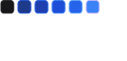

<h1 align="center"> 

	 - Habbit (Hábitos)
</h1>

 <a href="#-sobre-o-projeto">Sobre</a> •
 <a href="#-tecnologias">Tecnologias</a> •
 <a href="#-instalação">Setup</a> •

&nbsp;

&nbsp;

## 💻 Sobre o projeto

🚀 Projeto fullstack de app de monitoramento de hábitos com calendário mostrando hábitos por dia com tonalidades de cores diferentes para identificar a conclusão de hábitos a cada dia. Possibilidade de criação e edição de conclusão de hábitos diariamente.

BACKEND:

- TypeScript
- TSX
- Fastify
- Prisma
- Zod

FRONTEND:

- ViteJs
- ReactJs
- TypeScript
- Tailwindcss
- Radix
- Axios

MOBILE:

- React-Native
- Expo
- TypeScript
- NativeWind
- Axios

Possui as funcionalidades de:

- Calendário interativo com identificação de dia atual;
- Identificação de conclusão de hábitos nos dias, quanto mais azul menos hábitos concluídos no dia;
- Possibilidade de criação de novos hábitos marcando os dias que o mesmo será monitorado;
- Edição (toggle) de hábitos por dia entre concluído e a concluir.
- Barra de progresso de hábitos por dia. Concluídos Vs a concluir.

Projeto foi realizado no NLW-Setup da Rocketseat.
